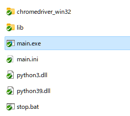
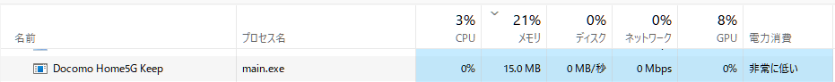

# seleniumを使って「ドコモホーム5G」の5Gをキープさせる

**ドコモホーム5Gキープ(Docomo Home5G Keep)**

## 概要

ブラウザを自動操作したり、スクレイピングしたりできるPythonライブラリ「selenium」を使ったバッチです。ドコモホーム5Gはすぐに4Gに切り替わってしまい、5Gに固定できないという難点がありました。このバッチを常時稼働させることで、常時5Gを保つことができます。

## 動作環境

| 環境                 | 条件         |
| :------------------- | :----------- |
| ドコモホーム5Gの型番 | home 5G HR01 |

## ダウンロード

最新バージョンv1.0.0.1のダウンロードは[こちら](https://github.com/yuusanx3/docomo_home5g_keep_release/releases/tag/v1.0.0.1)

## 使い方

1. zipファイルをダウンロードし、解凍します。

2. 以下のフォルダごと好きな場所に移動させて構いません。

   ```
   /build/Docomo Home5G Keep
   ```

3. 上記フォルダ内の`main.ini`を変更します。 

   `password`にホーム5Gのパスワードを設定します。

   ```ini
   [home5g]
   index = http://web.setting/index.html
   network = http://web.setting/mifi-network-configuration.html
   password = {ホーム5Gのパスワード}
   ```

4. 上記フォルダ内の`main.exe`をダブルクリックして起動します。  
     

5. 稼働中のPCへの負荷はほとんどありません。  
     

6. 停止するには、以下の2つのexeをタスクマネージャーで停止します。  
     
     
   ※上記フォルダ内の`stop.bat`でも止められますが、全ての`main.exe`と`chromedriver.exe`という名前のexeが止まるので注意。

## どういう仕組みか

ホーム5Gには`5G/4G`もしくは、`4G`の2通りのネットワーク設定があります。確認時点のネットワークが4Gであった場合に、一度`4G`に切り替えて、`5G/4G`に戻します。こうすることでホーム5Gが再度ネットワークの探索を行うので、5G圏内の場合には、5Gにすることができます。

ですが、どうやらホーム5Gの管理画面にアクセスするだけで、5Gを保持できてるような気がします。なので、このプログラム起動中は一度も設定の切り替えは起きていません。もしかしたら、5G圏内ギリギリの場合はうまく動作しないかもしれません。

## seleniumの軽い使い方

### ChromeDriverをインストール

[こちら](https://chromedriver.chromium.org/downloads)のページからPCに入っているChromeのバージョンにあったものをインストールします。

### Chromeドライバーの設定

```python
# Chromeドライバーの設定
# コンソールにChromeDriverのログが出ないように設定する
options = Options()
options.add_argument('--headless')
options.add_argument('--disable-logging')
options.add_argument('--log-level=3')
options.add_experimental_option('excludeSwitches', ['enable-logging'])
# executable_pathにChromeDriverのパスを設定する
chrome_service = service.Service(executable_path=self.__config["selenium"]["chromedriver"])
# Chromeのウィンドウを出さずに実行する
chrome_service.creation_flags = CREATE_NO_WINDOW
# 上記設定を反映させたドライバーを取得
# 以後このdriverを使って操作を行う
driver = webdriver.Chrome(service=chrome_service, options=options)
```

### URLの読み込み

```python
# driver.get({URL})
driver.get(self.__url_index)
```

### 要素を取得

```python
# driver.find_element(By.XPATH,{XPath})
# find_elementのBy.???で様々な指定ができる
# 以下の例ではXPathで指定している
current_network = driver.find_element(By.XPATH,"/html/body/div/div/div[3]/section/div/div[2]/div[1]/div[1]/div[2]/div[2]/div/span[2]")
```

### ボタンのクリック

```python
# ボタン要素を取得した場合、クリックができる。
login_btn = driver.find_element(By.XPATH,"/html/body/div/div/div[2]/nav/div[2]/ul/li[7]/button")
login_btn.click()
```

### テキストの入力

```python
# テキストボックスの要素.send_keys()でテキストを入力できる。
password = driver.find_element(By.XPATH,"/html/body/div[1]/div/div[4]/div/div/div[2]/form/div[1]/input")
password.send_keys("入力したい文字列")
```

### submitする

```python
# form内の要素の場合は、以下のようにsubmitできる。
password.submit()
```

### プルダウンメニューの選択

```python
# select要素を取得
select_mode = driver.find_element(By.XPATH,"/html/body/div/div/div[3]/section/div/div[2]/div/div/div[2]/div[1]/div/select")
# select要素の選択肢を取得
select = Select(select_mode)
# 選択肢を選択
# select_by_indexは0から数えたインデックス
select.select_by_index(1)
```

### JavaScriptのアラートのOKボタンを押す

```python
Alert(driver).accept()
```

## 最後に

いい感じに`time.sleep()`で待ってあげないと、うまく動作しなかったりします。なので、動作を保証するために多めに待つのでレスポンスはあまりよくありません。この辺を工夫して動作速度を早くできればいいですね。

## 更新履歴

### 1.0.0.1

- 細かい修正

### 1.0.0.0

- 新規作成
